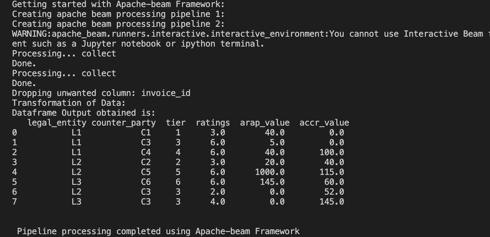
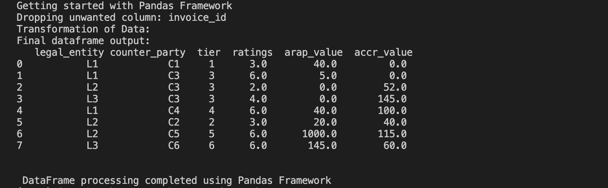

# Project Overview

In this project, we leverage two distinct input datasets: dataset1.csv and dataset2.csv .

# Frameworks
To accomplish our objectives, we employ two powerful frameworks:

1. Pandas
2. Apache Beam

# Getting Started
## Pre-Requisites
To begin, ensure the following prerequisites are met:

1. Utilize VSCode as your integrated development environment.
2. Utilize Python3 as the programming language.
3. Create and activate a virtual environment using the following commands:
```
python3 -m pip install virtualenv
python3 -m virtualenv venv

[In Mac]
source venv/bin/activate

[In windows]
venv/Scripts/activate
```

4. Install Pandas framework, Apache Beam framework and other requirements if any by executing the following command:
```
pip install -r requirements.txt
```

# Instructions to proceed with the following steps:

1. Utilize the two input files: dataset1.csv and dataset2.csv
2. Adjust the location of datasets: dataset1.csv and dataset2.csv appropriately.
3. Perform a join operation between dataset1.csv and dataset2.csv, implementing any required transformations.

# Running the Script:
1. For Apache Beam script
```
python3 implement_using_apache_beam_framework.py
```
2. For Pandas script
```
python3 implement_using_pandas_framework.py  
```
# Output
The desired output will be generated in the form of two CSV files: result_pandas.csv and result_apache_beam.csv.

1. For Apache Beam script



2. For Pandas script
